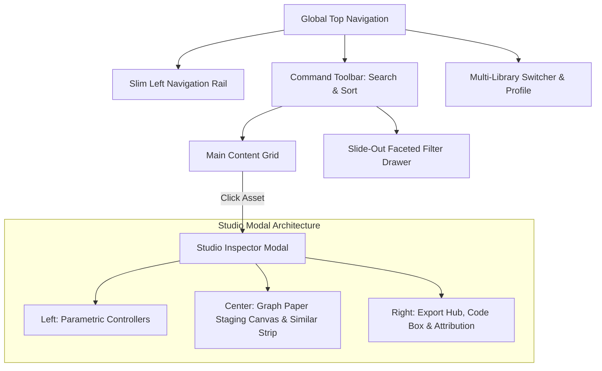

# Motvin Studio UI Pattern & Architecture System

## Executive Overview

This design specification deconstructs the UI architecture, visual tokens, micro-interactions, and component hierarchies of **Motvin Studio** (`motvin.com/icons`) into a production-ready design system for SaaS tools, asset managers, and studio-grade web applications.

---

## 1. Visual Hierarchy & Spatial Architecture

The Motvin UI architecture is composed of two primary modes:
1. **The Discovery Catalog Hub**: High-density, fast-filtering grid with a slim left rail, top command bar, and collapsible slide-over facet panel.
2. **The Studio Inspector Modal**: A 3-column parametric workbench for previewing, fine-tuning, and exporting assets.



---

## 2. Design Tokens

| Token Category | Variable / Value | Description |
| :--- | :--- | :--- |
| **Canvas Background** | `#FFFFFF` | Pure crisp white for cards and modal dialogs |
| **Grid Lines** | `#F1F5F9` | Subtle millimeter graph-paper grid pattern |
| **App Stage** | `#F8FAFC` to `#FAFAFA` | Neutral foundation for contrast |
| **Primary CTA** | `#10B981` (Hover: `#059669`) | Emerald green for export and affirmative actions |
| **Primary Neutral** | `#18181B` (Zinc-900) | High-contrast dark button for bookmarking/saving |
| **Tag Accent** | `#EEF2FF` / `#4F46E5` | Soft indigo pill for category badges |
| **Disclaimer Box** | `#F5F3FF` / `#4338CA` | Violet-tinted legal and asset attribution callout |
| **Border Subtle** | `#E5E7EB` / `#F1F5F9` | Clean structural separation |
| **Modal Radius** | `24px` | Smooth, friendly outer shell |
| **Control Radius** | `9999px` (Pill) / `8px` | Segmented controls and preset chips |

---

## 3. Core Component Anatomies

### A. The 3-Column Studio Modal

```
+---------------------------------------------------------------------------------------------------+
| BREADCRUMB: Icons > Others > captions                     [Share] [Help] [Fullscreen] [Close X]   |
+---------------------+---------------------------------------------+-------------------------------+
| LEFT PARAMETERS     | CENTER STAGING WORKBENCH                    | RIGHT EXPORT & ATTRIBUTION    |
| (Width: 220px)      | (Flex: 1)                                   | (Width: 310px)                |
|                     |                                             |                               |
| • STROKE            | • GRAPH PAPER CANVAS CONTAINER              | • EXPORT SETTINGS             |
|   - Cap (Pill)      |   - 20px grid background                    |   - Split CTA: [Copy] [Down]  |
|   - Join (Pill)     |   - Live rotating / padded SVG              |   - Copy PNG button           |
|   - Pattern (Pill)  |                                             |   - Format Dropdown           |
|                     | • METADATA & ACTIONS                        |   - Code Snippet Box (Copy)   |
| • TRANSFORM         |   - Title + Category Badges                 |                               |
|   - Rotation Slider |   - [Save] and [Find Similar] buttons       | • LICENSE & ATTRIBUTION       |
|   - Padding Slider  |                                             |   - Source & License link     |
|   - Flip Toggles    | • SIMILAR ICONS CAROUSEL                    |   - Attribution requirement   |
|                     |   - Horizontal row of variation cards       |   - Commercial use status     |
| • RESET BUTTON      |   - Percentage match badges (e.g. 93%)      |   - Third-party legal notice  |
+---------------------+---------------------------------------------+-------------------------------+
```

### B. Segmented Pill Controls
- Encased in a soft background capsule (`#F1F5F9`).
- Active item uses pure white background with subtle micro-shadow (`0 1px 2px rgba(0,0,0,0.06)`).
- Instant switching without page jump.

### C. Continuous Range Sliders with Discrete Preset Chips
- Never leave a slider without numeric feedback.
- Place discrete one-click chips below the track (e.g., `[16] [20] [24] [32]`).
- Clicking a chip immediately updates both the slider position and numeric display.

### D. Export Hub with Split Primary Action
- Primary CTA is emerald green (`#10B981`).
- Split button pattern allows instant one-click copy of the active format or dropdown access to alternatives.
- Syntax snippet preview box with floating "Copy" button provides immediate code access for developers.

---

## 4. Location of Reusable Files in this Project

1. **Antigravity Customization Skill**:
   - Location: `.agents/skills/motvin-studio-designer/SKILL.md`
   - Purpose: Directs the AI agent to follow this exact architectural blueprint.
2. **Design Tokens & Complete Component Implementations**:
   - Location: `.agents/skills/motvin-studio-designer/references/design-tokens-and-patterns.md`
   - Purpose: Copy-pasteable React, CSS, and component source code.
3. **Companion Workspace Skill**:
   - Location: `.skills/motvin-studio-designer_SKILL.md`
   - Purpose: Project-level skill file matching existing workspace conventions.
