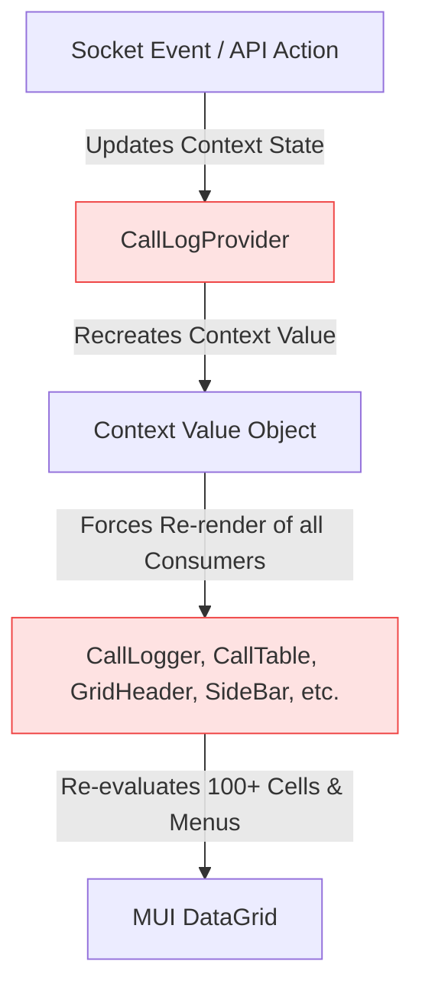
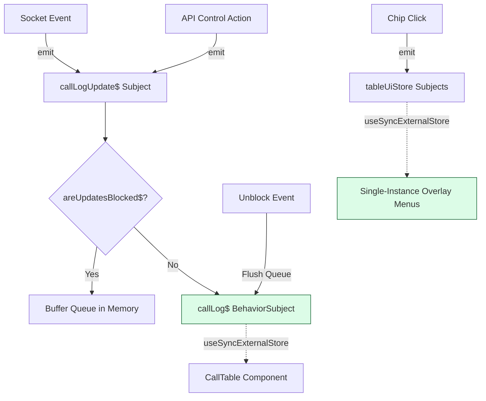

# Advanced RxJS Optimization Plan for Call Logger Module

This document outlines the architectural blueprints, bottleneck analysis, and step-by-step implementation templates for replacing the current React Context and state-based Call Logger layout with an **RxJS Reactive Stream-Based Architecture**.

---

## 1. Architectural Bottlenecks (Current System)



### The Three Main Performance Pitfalls:
1. **Context Rendering Waterfall:** Any modification to the call log list or active call session creates a new Context reference. This forces every single consuming component (`CallTable`, `GridHeader`, `SideBar`, `EscalationMenu`) to re-render, even if they only need static lookup tables or utility handlers.
2. **Duplicate Menu Renders in DataGrid:** In `ColumnConfig.jsx`, every cell in the Priority, Status, Client Status, and Forward columns renders its own `<Menu>` and `<MenuItem>` lists inside `renderCell`. With 100+ rows, the DOM is bloated with hundreds of hidden popup menus, all of which re-evaluate their state on every render pass.
3. **API Refetch Storm on Control Actions:** Currently, starting, ending, pausing, or resuming a call toggles a boolean (`refreshList`) which initiates a full HTTP GET query to the backend database to reload the entire table. This creates unnecessary network traffic and makes updates feel sluggish.

---

## 2. Optimized RxJS Reactive Design



### Key Performance Solutions:
1. **Zero-Render UI Menus:** We extract the `<Menu>` items from cells and place exactly **one instance** of each menu as a floating overlay at the bottom of the table. Clicking a cell Chip emits an event containing the `anchorEl` to an RxJS Subject. Only the floating menu component re-renders to display itself.
2. **Optimistic Local Updates (0-Refetch):** All API control actions (start, end, pause, resume) will merge their returned call records directly into the local `callLog$` BehaviorSubject instead of calling `triggerRefresh()`.
3. **Pausable Buffered Event Streams:** Real-time socket events are piped through a buffer that intercepts updates while the user is actively editing. Once the user closes the editor, the queue is flushed in **one single batch update**, triggering a single React render pass.

---

## 3. Implementation Code Blueprints

### A. The Core RxJS Store (`src/store/callLogStore.js`)
Handles core data lists, active calls, and the pausable/buffered socket pipeline.

```javascript
import { BehaviorSubject, Subject, interval } from "rxjs";
import { filter, takeUntil } from "rxjs/operators";

// Core State Subjects
export const callLog$ = new BehaviorSubject([]);
export const currentCall$ = new BehaviorSubject(null);
export const activeFollowUp$ = new BehaviorSubject(null);
export const areUpdatesBlocked$ = new BehaviorSubject(false);
export const timer$ = new BehaviorSubject(0);

// Unified Event Channel for updates
export const callLogUpdate$ = new Subject(); // emits: { type: 'ADD' | 'UPDATE', data: CallRow }

// Local memory queue to buffer updates when editing
let bufferedUpdates = [];
const stopTimer$ = new Subject();

// Helper: Merges single event into active log list
const mergeEventIntoList = (list, event) => {
  if (event.type === "ADD") {
    if (list.some((c) => c.sr === event.data.sr)) return list;
    return [event.data, ...list];
  }
  if (event.type === "UPDATE") {
    return list.map((c) => (c.sr === event.data.sr ? { ...c, ...event.data } : c));
  }
  return list;
};

// Subscribe to event updates
callLogUpdate$.subscribe((event) => {
  if (areUpdatesBlocked$.value) {
    bufferedUpdates.push(event); // Queue during edits (0 renders)
  } else {
    callLog$.next(mergeEventIntoList(callLog$.value, event));
  }
});

// Watch block state changes to flush queue
areUpdatesBlocked$.pipe(
  filter((blocked) => !blocked)
).subscribe(() => {
  if (bufferedUpdates.length > 0) {
    let list = [...callLog$.value];
    bufferedUpdates.forEach((event) => {
      list = mergeEventIntoList(list, event);
    });
    callLog$.next(list);
    bufferedUpdates = [];
  }
});

// Timer controller
export const startCallTimer = (startTimestamp) => {
  stopTimer$.next();
  interval(1000)
    .pipe(
      takeUntil(stopTimer$),
      filter(() => {
        const active = currentCall$.value;
        return active && !localStorage.getItem("call_is_paused");
      })
    )
    .subscribe(() => {
      const elapsed = Math.floor((Date.now() - startTimestamp) / 1000);
      timer$.next(elapsed);
    });
};

export const stopCallTimer = () => {
  stopTimer$.next();
  timer$.next(0);
};
```

---

### B. UI Event Subjects (`src/store/tableUiStore.js`)
Manages UI overlays to bypass global table re-renders on Chip clicks.

```javascript
import { Subject } from "rxjs";

// Emits: { anchorEl, row } or null (to close)
export const priorityMenu$ = new Subject();
export const statusMenu$ = new Subject();
export const estatusMenu$ = new Subject();
export const forwardMenu$ = new Subject();
```

---

### C. Refactored Columns Configuration (`src/components/CallLogger/ColumnConfig.jsx`)
Completely stripped of inline `<Menu>` components and bound state handlers.

```javascript
import React from "react";
import { Chip, Box } from "@mui/material";
import { getPriorityColor, getStatusColor } from "../../libs/data";
import { priorityMenu$, statusMenu$, estatusMenu$, forwardMenu$ } from "../../store/tableUiStore";

export const getCallColumns = ({ viewMode }) => {
  return [
    {
      field: "priority",
      headerName: "Priority",
      width: 100,
      renderCell: (params) => {
        const { label, color } = getPriorityColor(params.value);
        return (
          <Box sx={{ width: "100%", display: "flex", justifyContent: "center", alignItems: "center", height: "100%" }}>
            <Chip
              label={label ? label : "-"}
              color={color}
              size="small"
              sx={{ fontSize: "0.7rem", height: 20 }}
              onClick={(e) => {
                e.stopPropagation();
                priorityMenu$.next({ anchorEl: e.currentTarget, row: params.row });
              }}
            />
          </Box>
        );
      },
    },
    {
      field: "status",
      headerName: "Internal Status",
      width: 150,
      renderCell: (params) => {
        const { label, color } = getStatusColor(params?.value);
        return (
          <Chip
            label={label}
            color={color}
            size="small"
            sx={{ fontSize: "0.7rem", height: 20 }}
            onClick={(e) => {
              e.stopPropagation();
              statusMenu$.next({ anchorEl: e.currentTarget, row: params.row });
            }}
          />
        );
      },
    },
    {
      field: "Estatus",
      headerName: "Client Status",
      width: 150,
      renderCell: (params) => {
        const { label, color } = getStatusColor(params?.value);
        return (
          <Chip
            label={label}
            color={color}
            size="small"
            sx={{ fontSize: "0.7rem", height: 20 }}
            onClick={(e) => {
              e.stopPropagation();
              estatusMenu$.next({ anchorEl: e.currentTarget, row: params.row });
            }}
          />
        );
      },
    },
    {
      field: "forward",
      headerName: "Forward",
      width: 150,
      renderCell: (params) => {
        return (
          <Chip
            label={params?.value}
            size="small"
            sx={{ fontSize: "0.7rem", height: 20, borderRadius: "2px", bgcolor: "transparent" }}
            onClick={(e) => {
              e.stopPropagation();
              forwardMenu$.next({ anchorEl: e.currentTarget, id: params?.row?.id, row: params?.row });
            }}
          />
        );
      },
    },
    // ... remaining static / simple columns
  ];
};
```

---

### D. Single-Instance Floating Menus (`src/components/CallLogger/CallTable.jsx`)
Host the single-instance components inside the main layout.

```jsx
import React, { useEffect, useState, useMemo } from "react";
import { DataGrid } from "@mui/x-data-grid";
import { Menu, MenuItem } from "@mui/material";
import EscalationMenu from "./Escalation";
import { getCallColumns } from "./ColumnConfig";
import { priorityMenu$, statusMenu$, estatusMenu$, forwardMenu$ } from "../../store/tableUiStore";

const CallTable = ({ callLogs, viewMode, onSelectStatus, onSelectEstatus, onSelectPriority, showNotification }) => {
  // Columns memoized once - does NOT rebuild when menus open/close
  const columns = useMemo(() => getCallColumns({ viewMode }), [viewMode]);

  return (
    <div style={{ height: "100%", width: "100%", position: "relative" }}>
      <DataGrid
        rows={callLogs}
        columns={columns}
        // ... standard settings
      />

      {/* Floating UI Menus - Positioned once in markup */}
      <FloatingPriorityMenu onSelect={onSelectPriority} />
      <FloatingStatusMenu onSelect={onSelectStatus} />
      <FloatingEstatusMenu onSelect={onSelectEstatus} />
      <FloatingForwardMenu showNotification={showNotification} />
    </div>
  );
};

// Isolated Floating Component Subscriptions (Renders = 0 on parent)
const FloatingPriorityMenu = ({ onSelect }) => {
  const [state, setState] = useState(null); // { anchorEl, row }

  useEffect(() => {
    const sub = priorityMenu$.subscribe(setState);
    return () => sub.unsubscribe();
  }, []);

  if (!state) return null;

  return (
    <Menu
      anchorEl={state.anchorEl}
      open={Boolean(state.anchorEl)}
      onClose={() => priorityMenu$.next(null)}
      sx={{ mt: 1 }}
    >
      {/* priority options loop */}
    </Menu>
  );
};

// ... Similar wrappers for FloatingStatusMenu, FloatingEstatusMenu, and FloatingForwardMenu
```

---

## 4. Verification & Testing Playbook

To ensure these optimization upgrades maintain safety and visual stability:

1. **React Profiler Validation:**
   - Run React DevTools Profiler in Chrome.
   - Click a Chip (e.g. Priority menu).
   - Verify that **0 other cells** render, and `CallTable` remains yellow/green (untouched). Only the `FloatingPriorityMenu` node should execute.
2. **Timer Pipeline Memory Leak Test:**
   - Start a call timer, toggle paused, refresh, and close.
   - Verify in the console that `interval` subscribers are cleaned up via `stopTimer$` (preventing memory leaks).
3. **Concurrent Sockets test:**
   - Set `areUpdatesBlocked$.next(true)` (simulate drawer open).
   - Dispatch 5 fake socket socket events.
   - Verify that the grid does not update, and once `areUpdatesBlocked$.next(false)` is dispatched, all 5 updates apply to the grid in **one single frame update**.
